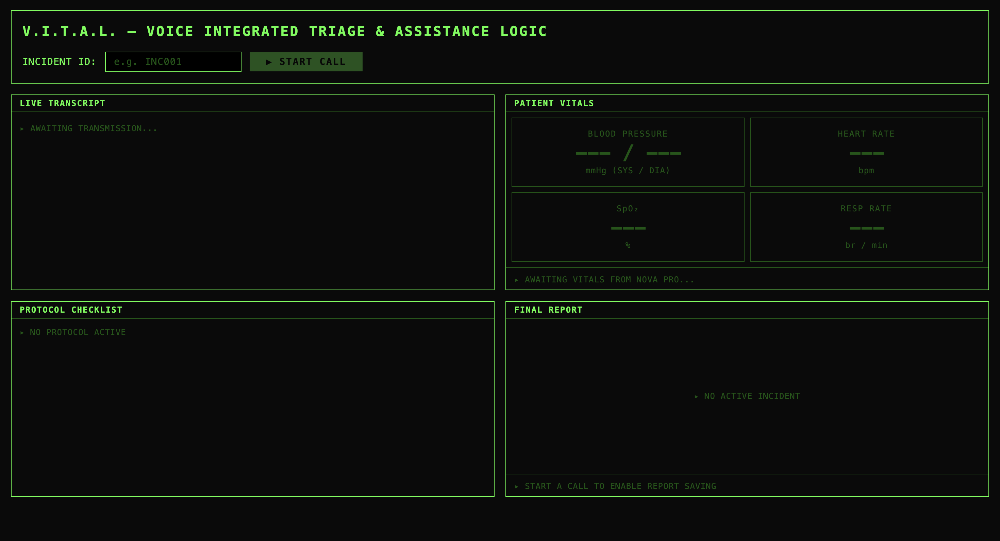

# V.I.T.A.L. — Voice Integrated Triage & Assistance Logic

A hands-free AI medical scribe for paramedics. Speak vitals and 
symptoms during an emergency — V.I.T.A.L. transcribes in real time, 
extracts structured medical data, auto-loads the correct EMS protocol 
checklist, and generates a complete incident report.

**Built for the Amazon Nova AI Hackathon**



## How It Works

1. Paramedic speaks during an active call
2. Amazon Nova 2 Sonic transcribes audio in real time
3. Amazon Nova 2 Pro extracts vitals, symptoms, and medications
4. Protocol checklist auto-populates based on detected condition
5. One click saves the complete incident report to disk

## Tech Stack

- **Frontend:** React, Tailwind CSS, Web Audio API
- **Backend:** Python, FastAPI, WebSockets
- **AI:** Amazon Nova 2 Sonic (transcription), Nova 2 Pro (extraction)
- **Storage:** JSON file persistence

## Prerequisites

- Python 3.10+
- Node.js 18+
- A Nova API key from [nova.amazon.com](https://nova.amazon.com)

## Setup & Running

### 1. Clone the repository
```bash
git clone https://github.com/yourusername/vital-medic-scribe.git
cd vital-medic-scribe
```

### 2. Backend setup
```bash
cd backend

# Create virtual environment
# Mac/Linux:
python -m venv .venv
source .venv/bin/activate

# Windows:
python -m venv .venv
.venv\Scripts\activate

# Install dependencies
pip install -r requirements.txt

# Create your .env file
echo "NOVA_API_KEY=your_api_key_here" > .env
```

### 3. Start the backend
```bash
# Make sure you're in the backend/ folder
uvicorn app.main:app --reload
```

Backend runs at `http://localhost:8000`
API docs available at `http://localhost:8000/docs`

### 4. Frontend setup (new terminal)
```bash
cd frontend
npm install
npm run dev
```

Frontend runs at `http://localhost:5173`

## Usage

1. Open `http://localhost:5173` in Chrome
2. Enter an incident ID (e.g. `INC001`)
3. Click **START CALL** and allow microphone access
4. Speak a medical scenario:
   > "Patient is a 52-year-old male, BP 150 over 90, 
   > heart rate 88, chest pain radiating to left arm"
5. Watch the transcript, vitals, and protocol checklist 
   populate in real time
6. Click **SAVE REPORT** to generate the incident report

Reports are saved to `backend/reports/`

## Project Structure
```
vital-medic-scribe/
├── backend/
│   ├── app/
│   │   ├── main.py              # FastAPI entry point
│   │   ├── config.py            # Configuration
│   │   ├── api/                 # Route handlers
│   │   ├── services/            # Nova AI integrations
│   │   ├── models/              # Data models
│   │   └── database/            # JSON file storage
│   └── requirements.txt
├── frontend/
│   └── src/
│       ├── components/          # UI components
│       ├── pages/               # Dashboard
│       └── services/            # API calls
└── README.md
```

## Nova Models Used

- **Nova 2 Sonic** (`nova-2-sonic-v1`) — Real-time speech-to-text 
  via WebSocket streaming
- **Nova 2 Pro** (`nova-2-pro-v1`) — Medical data extraction via 
  tool calling